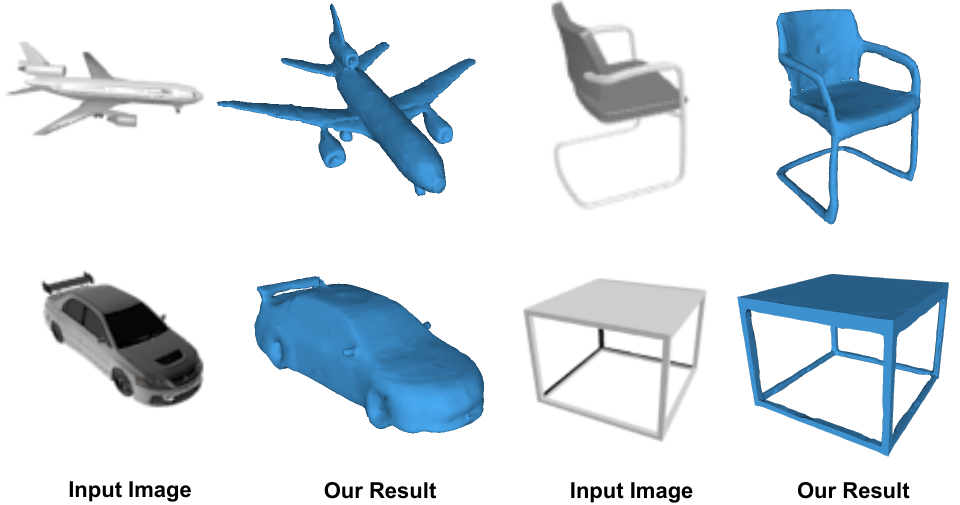
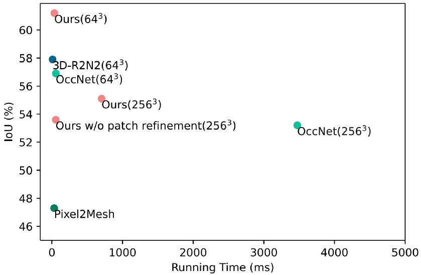
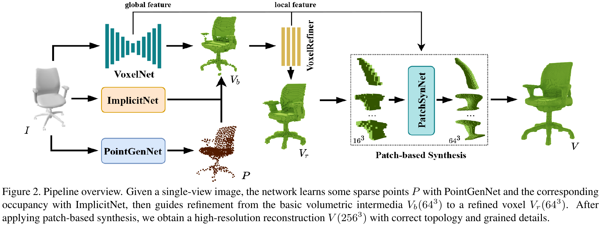

## VIPNet [[Paper]](https://ieeexplore.ieee.org/document/9320348)[[Video]](https://www.youtube.com/watch?v=SFLNboGzBbU)

**VIPNet: A Fast and Accurate Single-View Volumetric Reconstruction by Learning Sparse Implicit Point Guidance**  
[Dong Du](https://dongdu3.github.io/), Zhiyi Zhang, [Xiaoguang Han](https://mypage.cuhk.edu.cn/academics/hanxiaoguang/), [Shuguang Cui](https://sse.cuhk.edu.cn/en/faculty/cuishuguang), [Ligang Liu](http://staff.ustc.edu.cn/~lgliu/)  
Published in 2020 International Conference on 3D Vision (3DV).  



---

### Setup

This implementation has been tested on Ubuntu 18.04, using Pythton 3.6.9, CUDA 10.0, PyTorch 1.2.0, and etc. I apologize for not having the time to sort through these files. Please refer to our paper to use them.

  

To train the code, please install several external libraries.

1. Chamfer Distance  
   Please make and replace the "cd_dist_so.so" file for the calculation of Chamfer distance. The source code and introduction can be found from [Pixel2Mesh](https://github.com/nywang16/Pixel2Mesh/tree/master/external). 

2. [utils](https://github.com/autonomousvision/occupancy_networks/tree/master/im2mesh/utils)  
   Please refer to [Occupancy Networks](https://github.com/autonomousvision/occupancy_networks) to make these libraries and put them in the folder of "utils". 

---

### Citation

If you find our work helpful, please consider citing

```
@inproceedings{du2020vipnet,
  title={Vipnet: A fast and accurate single-view volumetric reconstruction by learning sparse implicit point guidance},
  author={Du, Dong and Zhang, Zhiyi and Han, Xiaoguang and Cui, Shuguang and Liu, Ligang},
  booktitle={2020 International Conference on 3D Vision (3DV)},
  pages={553--562},
  year={2020},
  organization={IEEE}
}
```

---

### License

VIPNet is relased under the MIT License. See the [LICENSE file](LICENSE ) for more details.